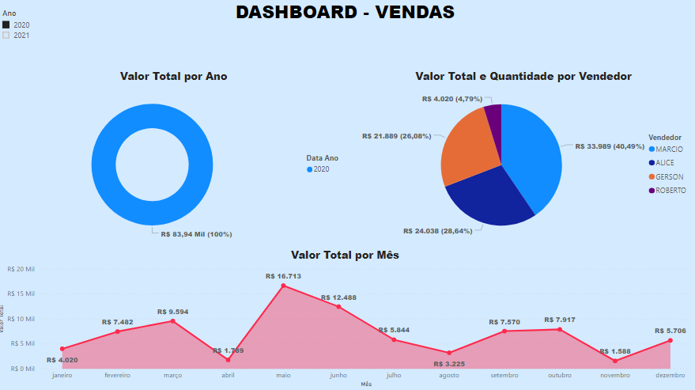
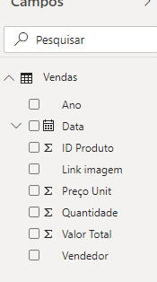

# Vendas-Sales---Dashboard 📈

## 📝 Description 

Dashboard desenvolvido através de um arquivo coletado através de um crawller (c#) onde montamos um arquivo do tipo .csv 
e realizamos o tratamento de dados através da ferramenta PowerBI.

# # Dashboard Presentation (COVID19) (BR)

  
# Tratament Data

Realizei alguns tratamentos e medidas, tais como:

• Filtros de Datas;
• Filtros por Região;
• Qtde de Óbitos;
• Qtde Novos Casos.
  

  
## 🚀 Technologies Used 

 

   

## 🔓 License 
MIT ©  Jonathan
